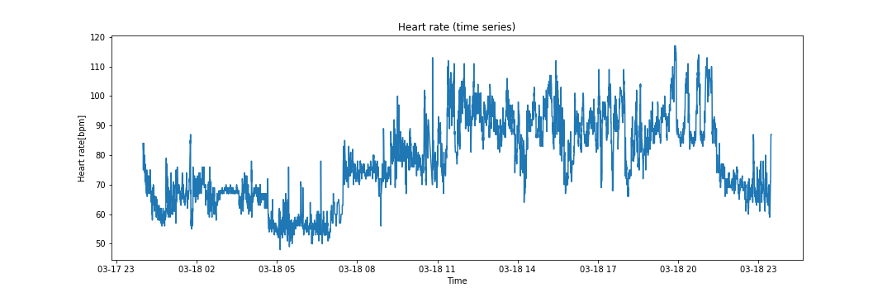
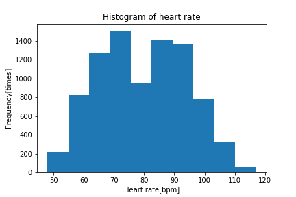
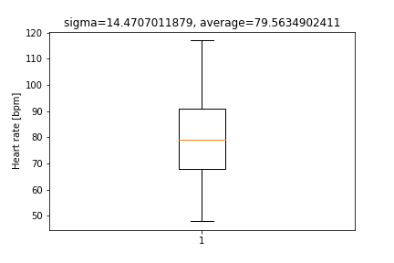
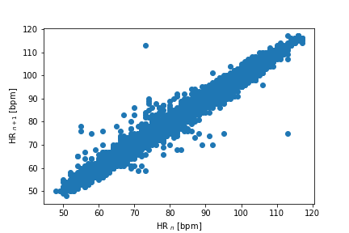

# 背景/目的

自分の心拍数、見たい。眠気推定みたいなのも興味ある。

# 必要なもの

Fitbit charge HR(2でも動くハズ)、人体、fitbit API

（git clone https://github.com/orcasgit/python-fitbit.git 直下においてください。）

# 参考にさせていただきました！

・Pythonでfitbit APIから心拍数を取得してみよう！

https://qiita.com/fujit33/items/2af7c4afdb4e07601def

